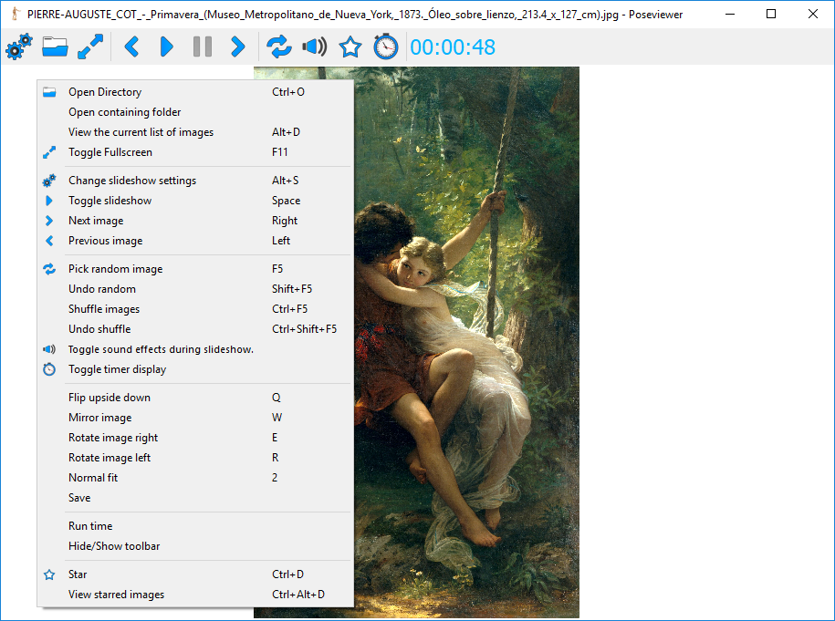

# Pose Viewer

An image viewer for artists.

## About

**UNFINISHED (ABANDONED)** 

A lightweight image viewer for artists. Written in Python 3 using PySide (Qt 4). 

### Features 
  * Customizable slideshows for gesture training,
  * save favorite images (stars),
  * GIF support,
  * keyboard shortcuts ...

## Screenshots

   
